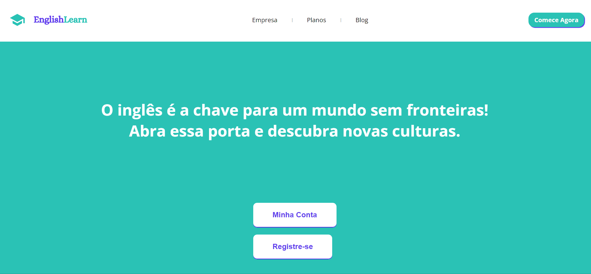

# Início do projeto English Learn

  (link https://oiangelica.github.io/english-learn/)

Esse projeto está sendo desenvolvido com o intuíto de ser um site para aprendizado da língua inglesa, através do método flashcards, com o clique dos usuários vamos jogar cartões de memorização contendo palavras e imagens de forma aleatória, para fácil associação do significado e rápida absorção do indioma. 

## Tecnologias utilizadas 

- HTML

- CSS

## Fica aqui comigo para acompanhar as atualizações deste projeto! 🚀💻

